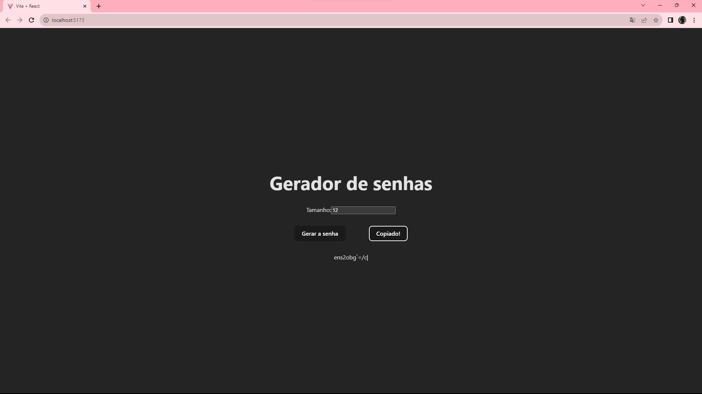

<h1>GERADOR DE SENHA</h1>

Este mini Projeto é para treinar as Habilidades de React com Vite, o mesmo tem como objetivo de gerar senhas aleatórias. A senha será exibida na tela juntamente com um botão de "copiar" que copia o texto da senha para a área de transferência. Após copiar, o botão para a área de transferência muda seu texto para "Copiado!" e, após gerar uma nova senha, o texto do mesmo botão volta ao valor incial "Copiar".

